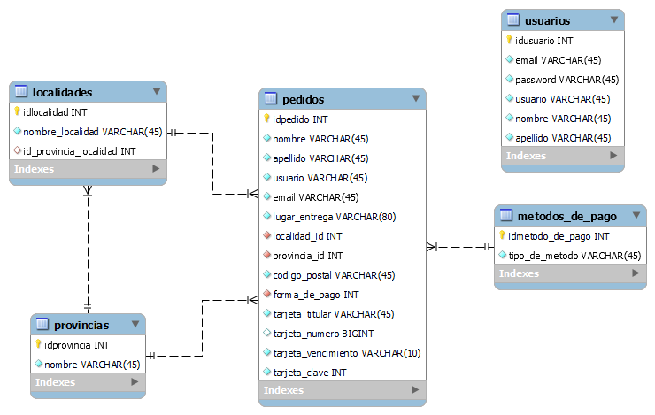

# Trabajo final Java Web

- Página de Home(index).
- Página de logueo.
- Página con formulario de pedidos (validaciones desde el front).
- Página de consulta de pedidos.
- Conexión a la base de datos realizada con JDBC.

Todos los estilos fueron realizados con bootstrap, exceptuando el home que explicitamente fue requerido hacerlo con css vanilla.

## Video
[![Video muestra del proyecto]](https://user-images.githubusercontent.com/85445806/209583086-f8e67458-d885-49d7-9c04-ca5b4b686cb5.mp4)

## Tecnologías utilizadas

---

**Desarrollo del proyecto:**

IDEs:

- Apache NetBeans [16](https://www.apache.org/dyn/closer.cgi/netbeans/netbeans-installers/16/Apache-NetBeans-16-bin-windows-x64.exe)
  - GlassFish Server
- Visual Studio Code.

**Tecnologías utilizadas para el desarrollo:**

- HTML5
- CSS3
- Bootstrap
- JavaScript (validaciones formulario)
- Java [JDK 17](https://www.oracle.com/java/technologies/downloads/#jdk17-windows)
  - MySQL Connector/J [5.1.49](https://downloads.mysql.com/archives/c-j/)
- MySQL Workbench

## Ambiente de desarrollo

---

**Instrucciones para armar el ambiente de desarrollo**

- Instalar los IDEs Apache NetBeans y Visual Studio Code.
- Instalar MySQL Workbench

- Clonar el repositorio
- Abrir la carpeta del proyecto webProyectCac en Apache NetBeans y la carpeta webProyectCac/web en Visual Studio Code.

**Base de datos:**

- Una vez abierto MySQL Workbench crear una nueva conexión o utilizar una ya existente.
- Desde el apartado File seleccionar “Run SQL Script” u “Open SQL Script”, ir a la carpeta "sql" donde se encuentran 3 scripts. Correr el script 'schema_cac_pi_2022.sql' que creará el schema con el nombre 'cac_integrating_proyect_2022' y sus tablas y relaciones correspondientes.
- Posteriormente abrir y correr el script de inserción de datos (inserts_cac_pi_2022.sql).
- En el script de queries hay algunas consultas básicas ya realizadas por si desea visualizar datos de las tablas.

  - _Script schema:_ schema_cac_pi_2022.sql
  - _Script inserts:_ inserts_cac_pi_2022.sql
  - _Script queries:_ queries_cac_pi_2022.sql

**Estructura y diagrama**

 
Diagrama ER

**Backend**

- En el archivo de 'Persistencia.java' debemos colocar los datos de nuestra base de datos (MySQL Workbrench) local. Es decir, el username y password.
- Posteriormente ejecutar con el botón de RUN el proyecto backend desde el Apache NetBeans.
